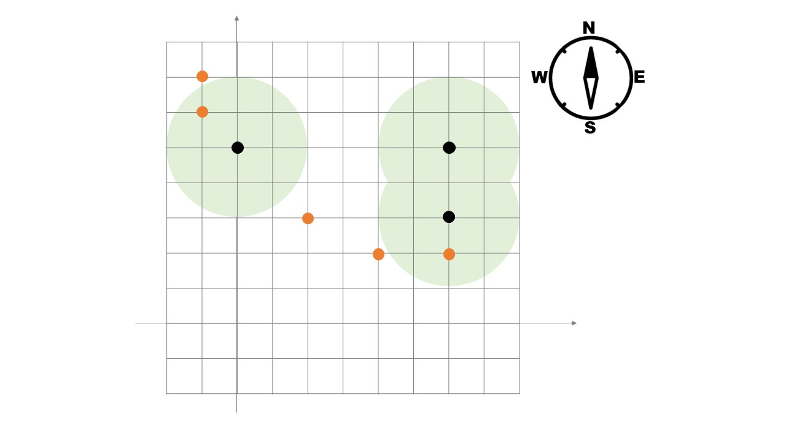

# Description
巷ではノケモンGOと呼ばれるゲームが流行っている。
ノケモンGOは、主人公がノケストップと呼ばれる場所を順に移動し、ノケモンを沢山集めることが目的である。

ある日、主人公のサトツは、 $N$ 個のノケストップを順に訪れた。
これらのうちの $i$ 個目のノケストップは、座標 $(p_i, q_i)$ に存在する。

また、ノケモンはフィールド上に $M$ 匹おり、それぞれ座標 $(x_i,y_i)$ にいる。

ノケストップに滞在中、サトツはノケストップからの距離が $L$ の範囲内（ちょうど $L$ や $0$ も含む）にいるノケモンを全て収集することができる。
なお、社会的要請により、ノケモンGOでは移動中にノケモンを捕まえようとすることが禁止されている。

この日にサトツが集めることのできるノケモンは最大で何匹か答えよ。

# Constraints
* $1 \leq N \leq 500$
* $0 \leq M \leq 500$
* $0 \leq L \leq 2\times10^4$
* $-10^4 \leq p_i, q_i, x_i, y_i \leq 10^4$

与えられる値は全て整数である。

# Input
1つの入力ファイルは複数のテストケースからなる。

入力ファイルの最初の1行目にはテストケースの個数 $T$ が記される $(1 \leq T \leq 50)$。

2行目以降には、 $T$ 個のテストケースが記述されており、各テストケースは次の形式で表される。

```
$N$ $M$ $L$
$p_1$ $q_1$
$p_2$ $q_2$
$\vdots$
$p_N$ $q_N$
$x_1$ $y_1$
$x_2$ $y_2$
$\vdots$
$x_M$ $y_M$
```

$(p_i, q_i)$ は $i$ 個目のノケストップの座標。

$(x_i, y_i)$ は $i$ 匹目のノケモンのいる座標。

# Output
各テストケースに対して、サトツが何匹ノケモンを集めることのできるかを1行ずつ出力せよ。

# Sample Input
```
2
3 5 2
0 5
6 5
6 3
-1 6
-1 7
2 3
4 2
6 4
1 2 0
3 0
2 0
3 0
```

# Sample output
```
2
1
```

1ケース目は以下の図のようなノケストップとノケモンの配置である。
2ケース目のように、ノケストップにノケモンがいることもある。


