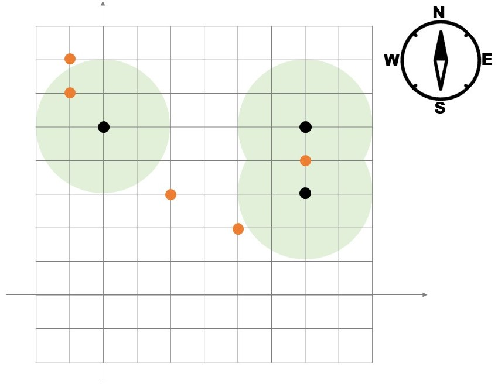

# Description
巷ではノケモンGOと呼ばれるゲームが流行っている。
ノケモンGOは、主人公がノケストップと呼ばれる場所を移動しながら、ノケモンを沢山集めることが目的である。

今、主人公のサトツは $N$ 個のノケストップを順に訪れた。
最初、サトツはフィールド上の原点 $(0,0)$ にいて、 $i$ 回目の移動で次のノケストップの座標である $(p_i, q_i)$ へ直線で移動する。
サトツはノケモンマスターを目指しているが、実はただの怠け者で無駄な移動はできるだけしたくないと考えている。このため、サトツはノケストップ間の移動で寄り道はせず、2つのノケストップ間を結ぶ直線を移動する。
また、$x$ 軸か $y$ 軸のどちらかに平行な移動しかできない。

ノケモンはフィールド上に $M$ 匹おり、それぞれ座標 $(x_i,y_i)$ にいる。
サトツは移動中、自分から距離 $L$ の範囲内（ちょうど $L$ や $0$ も含む）にいるノケモンを全て収集することができる。
サトツが集めることのできるノケモンは最大で何匹か答えよ。

# Constraints
* $1 \leq N \leq 500$
* $0 \leq M \leq 500$
* $0 \leq L \leq 2\times10^4$
* $-10^4 \leq x_i, y_i \leq 10^4$

与えられる値は全て整数である。

全ての $i (1 \leq i \leq N-1)$ に対して、$x_i = x_{i+1}$ または $y_i = y_{i+1}$ の少なくとも一方が成り立つ。

# Input
1つの入力ファイルは複数のテストケースからなる。

入力ファイルの最初の1行目にはテストケースの個数 $T$ が記される $(1 \leq T \leq 50)$。

2行目以降には、 $T$ 個のテストケースが記述されており、各テストケースは次の形式で表される。

```
$N M L$
$p_1 q_1$
$p_2 q_2$
$\vdots$
$p_N q_N$
$x_1 y_1$
$x_2 y_2$
$\vdots$
$x_M y_M$
```

$(p_i, q_i)$ は $i$ 個目のノケストップの座標。

$(x_i, y_i)$ は $i$ 匹目のノケモンのいる座標。

# Output
各テストケースに対して、サトツが何匹ノケモンを集めることのできるかを1行ずつ出力せよ。

# Sample Input
```
2
3 7 2
0 5
6 5
6 3
2 0
2 3
-1 6
-1 7
3 4
4 2
6 2
1 2 0
3 0
2 0
2 1
```

# Sample output
```
5
1
```

サンプルの1ケース目では以下の画像のように、ノケモンはオレンジ色の座標に存在しており、主人公は青線の通りの移動を行う。このとき、主人公は薄く緑で塗られた範囲のノケモンを捕まえることができるので、`5`を出力する。


