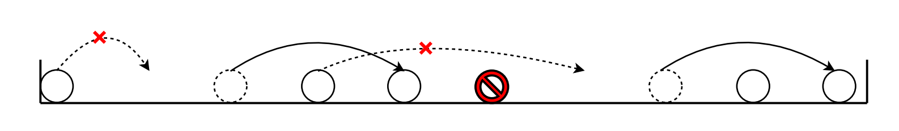

# Description
人が左から右に1列に並んでいる様子が文字列$S$で与えられる。  
文字は`o`、`.`、`x`の三種類ある。  
それぞれ`o`のところには人がいて、`.`のところには人がいない、`x`のところには障害物があることを表している。  
人々はこれから馬跳びをしようとしている。  
一回の馬跳びは以下のように決められる。  

*ある人の右に連続して一人以上の人を挟んで、人のいないところが存在する場合、その人はそこに跳んで移動できる。ただし、障害物が間にある場合は飛び越えられない。*

人々はなるべくたくさん馬跳びを楽しみたい。人々ができる馬跳びの合計回数の最大値を求めよ。

# Constraints
 - $ 1 \leq |S| \leq 100 $  
 $S$は`.`と`x`と`o`のみからなる。

# Input
1つの入力ファイルは複数のテストケースからなる。

入力ファイルの最初の1行目にはテストケースの個数$T$が記される($1 \leq T \leq 50$)。

2行目以降には、$T$個のテストケースが記述されており、各テストケースは次の形式で表される。
```
$S$
```

# Output
各テストケースに対して、人々ができる馬跳びの合計回数の最大値を1行ずつ出力せよ。

# Sample Input
```
3
ooo.
o.oo.x.oo.
oo........
```
# Sample Output
```
1
2
8
```
  

二つ目のケースの移動は上図のようになっている。最左の人は右に人がいないので移動できない。  
また、左から三番目の人は間に障害物があるので移動できない。  
よって、行われる馬跳びは最大で二回である。

